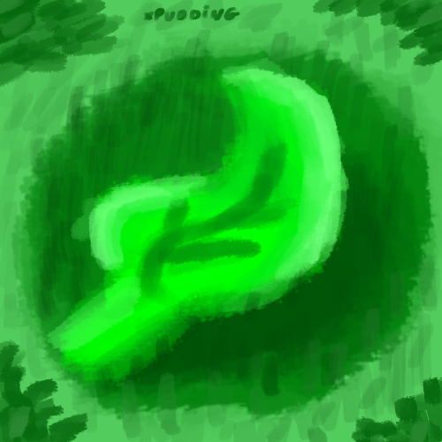

# EcoTask - EcoTarefas Diárias 

   
  “O mundo tornou-se perigoso porque os homens aprenderam  
  a dominar a natureza antes de dominar a si mesmos.”  
  - Albert Schweitzer

## Descrição
EcoTask é uma plataforma intuitiva para ajudar o ecosistema  com as suas tarefas diárias relacionadas. Nossa missão é incentivar práticas sustentáveis de através de um sistema simples e eficaz de gerenciamento de tarefas para estudantes.

## Funcionalidades
- **Rastreamento de Progresso:** Monitore o progresso das suas tarefas ecológicas.
- **Notificações:** Receba lembretes para garantir que suas tarefas diárias sejam concluídas.
- **Comunidade:** Conecte-se com outros usuários para trocar dicas e motivação.

## Como Usar
1. **Cadastro:** Crie uma conta na EcoTask.
2. **Adicionar Tarefas:** Insira suas tarefas diárias ecológicas.
3. **Acompanhe:** Utilize o painel de controle para verificar o andamento das suas tarefas.
4. **Complete:** Marque as tarefas como concluídas e veja seu progresso ecológico.

## Licença
Este projeto está licenciado sob a [Licença MIT](LICENSE).

---
## colaboradores
Gerencia do Projeto:
  

Back-end:

  
  

 

Front-end:

Analizes:
  

Design:
 

 

---

**EcoTask - Pequenas ações para um grande impacto ecológico!**
